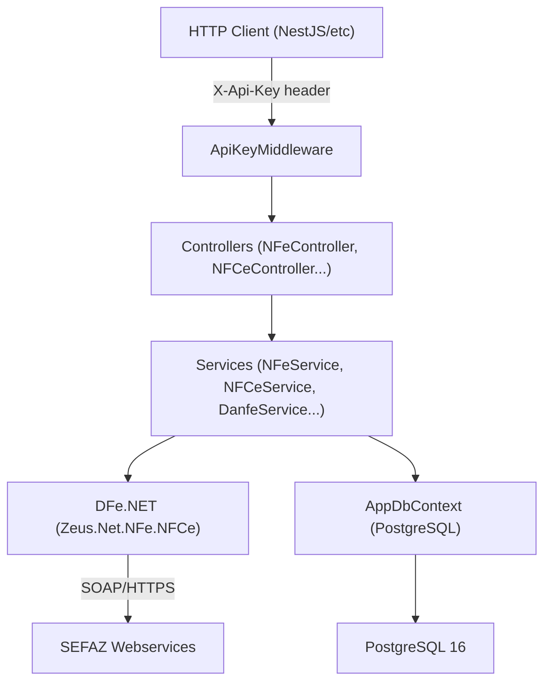

# Fiscal WebService ASP.NET Core 8 — Build Plan

## Overview

Greenfield ASP.NET Core 8 REST API acting as a centralized fiscal emission microservice. Consumed by Node.js/NestJS apps via HTTP. Deployable via Docker on Easypanel (VPS), no GUI or Windows dependency.

## Project Structure

```
FiscalService/
├── src/
│   └── FiscalService.Api/
│       ├── Controllers/         ← HTTP layer only (NFeController, NFCeController, ...)
│       ├── Services/            ← Business logic (NFeService, NFCeService, ...)
│       ├── Models/
│       │   ├── Requests/        ← Input DTOs
│       │   └── Responses/       ← Output DTOs
│       ├── Data/
│       │   ├── AppDbContext.cs
│       │   └── Entities/        ← EmissaoLog, NumeracaoSequencial
│       ├── Middlewares/         ← ApiKeyMiddleware
│       ├── Config/              ← FiscalConfig (bound from appsettings)
│       ├── Schemas/             ← XSDs from DFe.NET repo
│       ├── Program.cs
│       ├── appsettings.json
│       └── Dockerfile
├── docker-compose.yml
├── .env.example
├── PLANNING.md
├── PROGRESS.md
└── README.md
```

## Architecture



## Key Technical Decisions

- **No FastReport**: DANFE via `NFe.Danfe.Nativo` + embedded `PdfSharpCore` (Linux-safe)
- **No Singleton for emission services**: DFe.NET services are not thread-safe; instantiate per-request
- **PostgreSQL pessimistic lock**: `SELECT ... FOR UPDATE` via EF Core raw SQL for sequential numbering atomicity
- **Migrations on startup**: `dbContext.Database.MigrateAsync()` in `Program.cs`
- **Config hierarchy**: `appsettings.json` < `appsettings.Production.json` < env vars (prefix `FISCAL__`)

## Key Files to Create

- `src/FiscalService.Api/FiscalService.Api.csproj` — NuGet refs (EF Core 8, Npgsql, Serilog, DFe.NET, HealthChecks)
- `src/FiscalService.Api/Program.cs` — Builder, DI, middleware pipeline, health checks, migrations
- `src/FiscalService.Api/Middlewares/ApiKeyMiddleware.cs` — Header `X-Api-Key` validation → 401
- `src/FiscalService.Api/Config/FiscalConfig.cs` — POCO bound from `"Fiscal"` config section
- `src/FiscalService.Api/Data/AppDbContext.cs` — EF Core context, unique indexes, migration support
- `src/FiscalService.Api/Data/Entities/EmissaoLog.cs` + `NumeracaoSequencial.cs`
- `src/FiscalService.Api/Services/CertificadoService.cs` — Load/validate .pfx, never log passwords
- `src/FiscalService.Api/Services/NFeService.cs` — Emit, cancel, CCe, consult, void range
- `src/FiscalService.Api/Services/NFCeService.cs` — Emit (CSC/IdCSC), cancel
- `src/FiscalService.Api/Services/CTeService.cs` — Emit, cancel
- `src/FiscalService.Api/Services/MDFeService.cs` — Emit, close, cancel
- `src/FiscalService.Api/Services/DanfeService.cs` — PDF base64 via `DanfeNativoNfe` / `DanfeNativoNfce`
- `src/FiscalService.Api/Services/NumeracaoService.cs` — Atomic next number via pessimistic lock
- `src/FiscalService.Api/Controllers/` — 7 controllers, one per domain; thin, only call services
- `src/FiscalService.Api/Models/Requests/` + `Models/Responses/` — DTOs per endpoint
- `src/FiscalService.Api/Dockerfile` — Multi-stage build, Linux font deps, volume dirs
- `docker-compose.yml` — App + PostgreSQL 16, volumes, healthchecks
- `.env.example` — `API_KEY`, `DB_PASSWORD`, `FISCAL_AMBIENTE`
- `PLANNING.md` + `PROGRESS.md`

## NuGet Packages

```xml
<!-- Core -->
<PackageReference Include="Microsoft.EntityFrameworkCore" Version="8.*" />
<PackageReference Include="Npgsql.EntityFrameworkCore.PostgreSQL" Version="8.*" />
<PackageReference Include="Microsoft.EntityFrameworkCore.Design" Version="8.*" />

<!-- DFe.NET -->
<PackageReference Include="Zeus.Net.NFe.NFCe" Version="*" />
<PackageReference Include="Zeus.Net.CTe" Version="*" />
<PackageReference Include="Zeus.Net.MDFe" Version="*" />

<!-- DANFE nativo (Linux-safe, PdfSharpCore embutido) -->
<PackageReference Include="NFe.Danfe.Nativo" Version="*" />

<!-- Logs -->
<PackageReference Include="Serilog.AspNetCore" Version="8.*" />
<PackageReference Include="Serilog.Sinks.File" Version="5.*" />
<PackageReference Include="Serilog.Sinks.Console" Version="4.*" />

<!-- Health Checks -->
<PackageReference Include="AspNetCore.HealthChecks.NpgSql" Version="8.*" />
```

## Endpoints Summary

- `POST /api/nfe/emitir` → `NFeController.Emitir`
- `POST /api/nfe/cancelar` → `NFeController.Cancelar`
- `POST /api/nfe/carta-correcao` → `NFeController.CartaCorrecao`
- `POST /api/nfe/consultar` → `NFeController.Consultar`
- `POST /api/nfe/inutilizar` → `NFeController.Inutilizar`
- `GET  /api/nfe/status-sefaz` → `NFeController.StatusSefaz`
- `POST /api/nfce/emitir` + `cancelar`
- `POST /api/cte/emitir` + `cancelar`
- `POST /api/mdfe/emitir` + `encerrar` + `cancelar`
- `POST /api/consulta/status-servico`
- `POST /api/danfe/nfe` + `nfce`
- `POST /api/certificado/validar` + `upload`
- `GET  /api/numeracao/{cnpj}/{modelo}/{serie}`
- `POST /api/numeracao/confirmar`
- `GET  /health`

## Error Response Standard

All errors return:
```json
{ "sucesso": false, "erro": { "tipo": "...", "mensagem": "...", "detalhe": "...", "timestamp": "..." } }
```

Types: `ValidacaoSchema`, `RejeicaoSefaz`, `ServicoIndisponivel`, `CertificadoInvalido`, `ConfiguracaoInvalida`, `ErroInterno`

## UF Mapping

Static `MapearUf(string uf)` helper in a `UfHelper` static class covering all 27 UFs → `CodigoUfIbge` enum.

## Docker / Deploy

- Multi-stage Dockerfile: `sdk:8.0` build → `aspnet:8.0` final
- Linux font packages: `libfontconfig1 libfreetype6 fonts-dejavu-core` (required by PdfSharpCore)
- Volumes: `/app/xmls`, `/app/certificados`, `/app/logs`
- Health check: `curl -f http://localhost:8080/health`
- `docker-compose.yml` includes PostgreSQL 16 with healthcheck dependency
